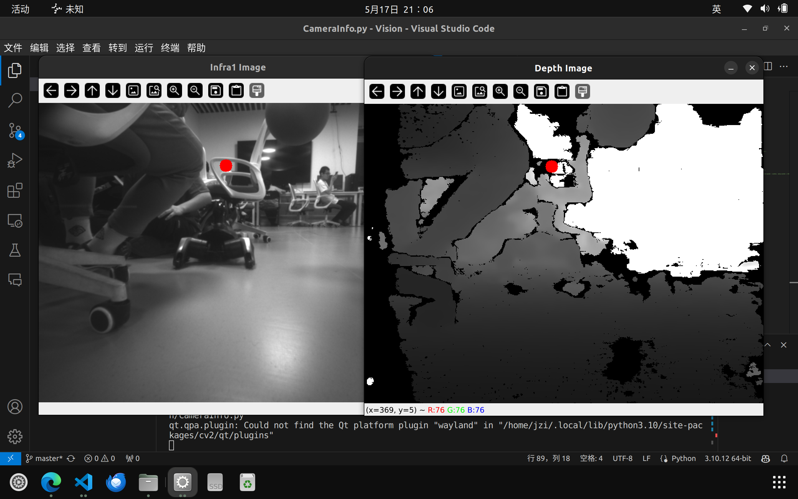
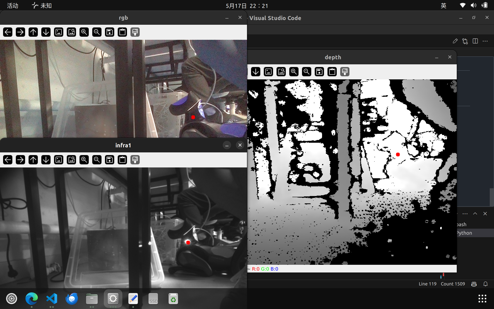

## 机器狗信息

4-1 NC077 4-2 YN275

4-1:mi@10.0.0.189 4-2:mi@10.0.0.245

连接密码：123

## 编译方法

输入如下命令build

```
cd ~/VisualLocate
colcon build
source ~/VisualLocate/install/setup.bash
```

然后用

```
ros2 run VisualLocate ...
```

运行编写好的程序

已经编写在一个bash中，可以通过下面代码build

```
source ~/VisualLocate/bash/build.bash
```

## realsense相机

在一个命令行中执行

```
ros2 launch realsense2_camera on_dog.py
```

之后不要关闭该命令行，打开新的命令行一次运行

```
ros2 lifecycle set /camera/camera configure
ros2 lifecycle set /camera/camera activate
```

已经将之编写在一个bash文件内,可以直接执行下面命令开启相机（realsense）

```
source ~/VisualLocate/bash/realsense2_camera.bash
```

可以用指令查看节点topic_type

```
ros2 topic type /camera/infra1/image_rect_raw
```

强烈建议不要使用bash脚本！容易有莫名其妙的bug

消息的encoding格式为mono8

## 鱼眼和RGB相机

```
ros2 launch camera_test stereo_camera.py
ros2 lifecycle set /stereo_camera configure
ros2 lifecycle set /stereo_camera activate
# ros2 lifecycle set /stereo_camera deactivate

```

编写在

```
source ~/VisualLocate/bash/stereo_camera.bash
```

## 色彩识别方案

在HSV颜色空间中，low = [31, 40, 00],high = [90, 255, 223]，可以识别到球，对于image_rgb

## Stereo_Camera相机参数

```
h_left: 400
h_rgb: 480
h_right: 400
w_left: 500
w_rgb: 640
w_right: 500
```

## 深度和灰度



可以看到，可以认为infra1和depth的图是对整齐的，如果能在infra1中找到球即可

## Infra1的参数

height=480, width=640,fx=388.5847168,cx=322.05200195,fy=388.5847168,cy=236.50979614
r=array([1., 0., 0., 0., 1., 0., 0., 0., 1.]),

## RGB的参数

fx=470.0

fy=464.68

cx=300.0

cy=250.50979614

width = 640

height = 320


