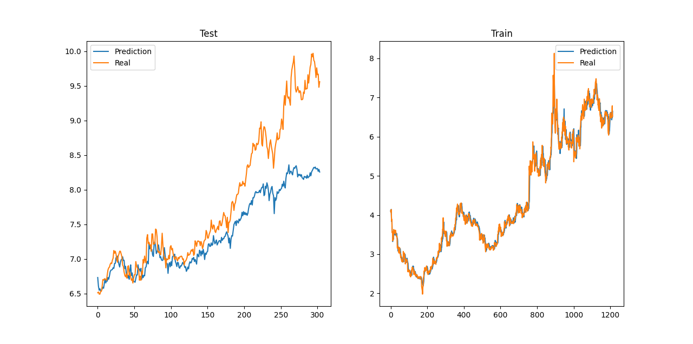
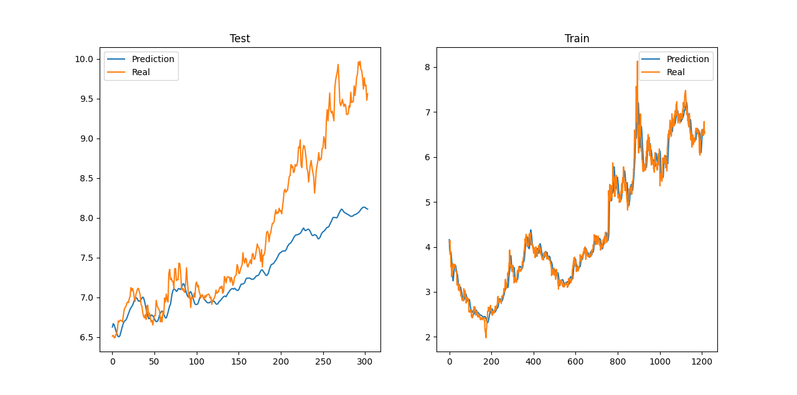
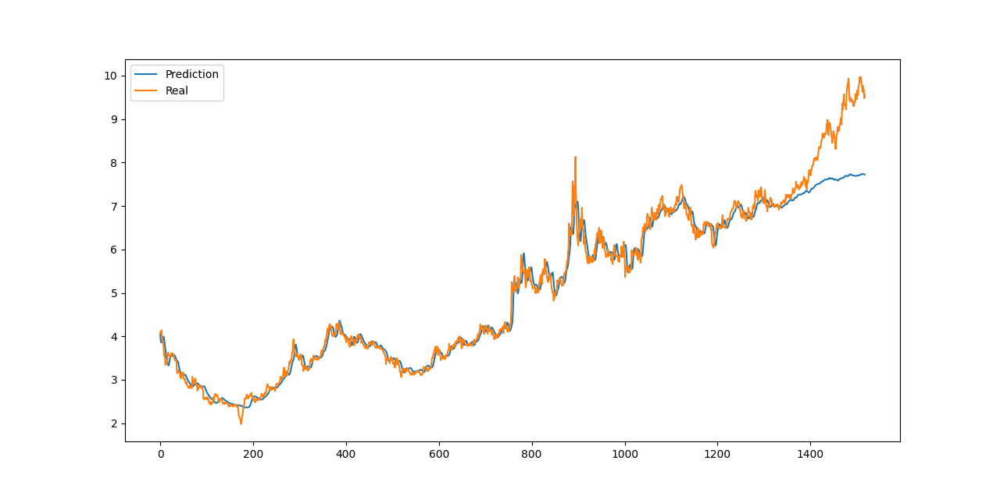

# Note

---

## 聚宽数据

关于JQData的使用方式，可以参见[JQData使用指南](https://www.joinquant.com/help/api/doc?name=JQDatadoc)

---

## util.py

这一部分中编写了一些工具函数

---

## PyTorch

关于Pytorch的使用文档，可以参考[PyTorch官方文档](https://pytorch.org/docs/stable/index.html)。

---

## 当前工作

### 数据集

总的数据为华能水电股票从2018年1月1日至今的所有日交易数据，包括成交量、开盘价、收盘价等共8个日内基本数据。

训练样本占比总数据的0.8，即日期前0.8的样本作为训练集，后0.2的样本作为测试集合。

### MLP模型

首先建立了MLP模型，先尝试基础的跟踪股价，以前15天股票每天的成交量，开盘价，收盘价等基本交易信息作为输入，以3天后股票的收盘价作为目标输出。

首先尝试了用MLP模型跟踪股价，发现效果并不好，在训练集上表现出过拟合和明显的滞后性，而在测试集上泛化效果相当差。示意图：

### LSTM模型

在发现MLP模型效果不佳后，又尝试了LSTM模型用于跟踪股价，仍然以前15天股票每天的成交量，开盘价，收盘价等基本交易信息作为输入，以3天后股票的收盘价作为目标输出。。

最终同样发现在训练集上体现滞后性，在测试集上表现效果不佳。

## 下一步工作

结合目前网络训练的经验，可以提出之后的一些优化方案：

* 上图中前1200个点为训练集，后面的为测试集。首先注意到在测试集上，随着测试集中样本在时间上距离训练集越来越远，模型拟合的效果就越差。**表明随着时间的推移，模型会逐渐失效。**
* 因此训练数据集的选择不应该是同一股票的长时间跨度的交易数据，更合理的方式是**选择短期内的相似股票的数据进行训练**，例如如果要预测华能水电在接下来的走向，更好的训练集的选择是与华能水电相似的其他大盘电力股在过去短期内的交易数据（例如同属电力板块的所有股票们在过去一个月的交易数据），而非华能水电在过去的所有交易数据。
* 目前的特征提取相对简单，没有考虑证券分析中常用的一些技术指标，如MACD指标，KDJ指标等，后续可以考虑引入这些指标作为网络的输入，使得网络能够更加有效的捕获股市中的信息。
