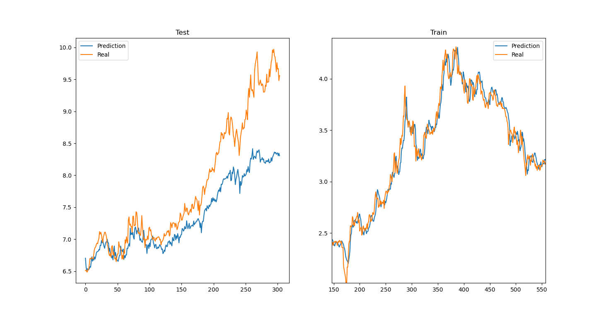

# Note

---

## 聚宽数据

关于JQData的使用方式，可以参见[JQData使用指南](https://www.joinquant.com/help/api/doc?name=JQDatadoc)

---

## util.py

这一部分中编写了一些工具函数

---

## PyTorch

关于Pytorch的使用文档，可以参考[PyTorch官方文档](https://pytorch.org/docs/stable/index.html)。

---

## 工作

### MLP模型

目前建立了MLP模型，先尝试基础的跟踪股价，以前15天股票每天的成交量，开盘价，收盘价等基本交易信息作为输入，以3天后股票的收盘价作为目标输出。

首先尝试了用MLP模型跟踪股价，发现效果并不好，在训练集上表现出过拟合和明显的滞后性，而在测试集上泛化效果相当差。示意图：

### LSTM模型

在发现MLP模型效果不佳后，又尝试了LSTM模型用于跟踪股价。
