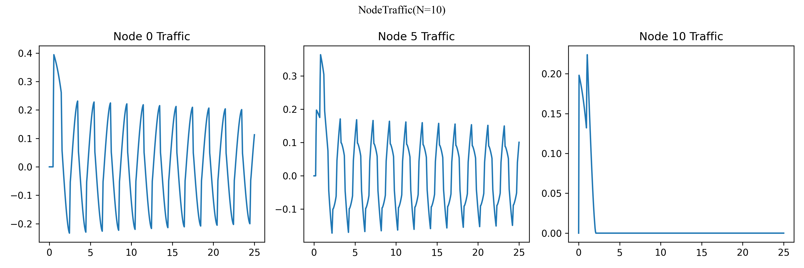
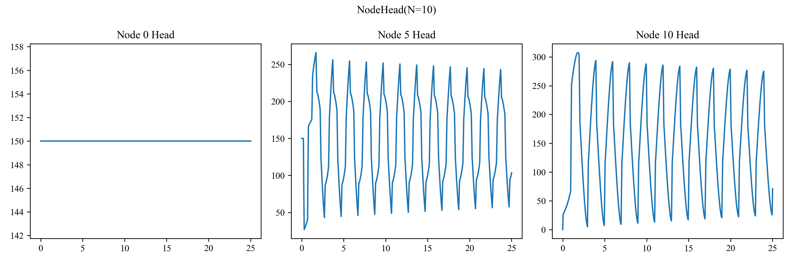

# 第一问

在初始阀门全开时，管道末端水头$H_0=H_R=150m$，而$(C_dA_g)_0=0.009$，带入公式$Q_o=(C_dA_g)_0 \sqrt{2gH_0}$计算得到，$Q_0=0.488m^3/s$。

# 第二问

先考虑边界条件，若$t=0$时阀门打开，在$t=0$边界上，流量$Q$均为0，而水头$H$除了阀门处为$0$，其他处均为$H_R$。然后在$x=0$边界上，水头恒定为$H_R$，在$x=L$边界上，水头流量满足关系$Q_0=k\sqrt{2gH_0},k=C_dA_g$。利用Question2.py中的迭代计算可以计算出水头和流量关于$x,t$的关系。

取$N=10$，计算结果如下图

取$N=20$，计算结果如下图

可以看到，当$N$分别取10和20时，计算出的流量、基本一致，这表明我们的网格划分是合理的。

# 第三题

