# 提交说明

## 须知

* 本次作业使用python3编程计算，在运行中调用了numpy、matplotlib库，在运行前需要确保当前运行python环境下已经安装这两个库，可以在终端使用下列命令安装相应的python库，图例使用Times New Roman字体，如果计算机上没有安装Times New Roman字体，将会按照matplotlib默认字体输出。

```
pip3 install numpy
pip3 install matplotlib
```

* 第[x]问所有脚本及输出图片已经存储到Question[x]文件夹下，例如第2问的脚本及输出图片就在Question2文件夹下。
* 在各个脚本中，二维数组Q,H即为计算得到的各流量和水头关于时间的关系，例如Q[m,n]表示n号节点在m号时间节点的流量，H[m,n]则为水头。m号时间节点的时间可由$t=m\cdot dt$计算得到，$dt$为设置的时间步长，$dt=L/(N\cdot a)$。
* 输出的水头、流量图像默认输出三个节点，分别为0号节点（上游水库端），N/2取整节点（即管道中间节点）和N号节点（阀门节点），输出的流量图像名为NodeTraffic().png，而水头图像为NodeHead().png，()表示可能的后缀表示计算条件，例如N=10，t_s=2.0等，图像将会存储在Quesiton[x]文件夹下。如果要输出其他节点n添加下列语句即可。

```
plt.plot([i*dt for i in range (N_t+1)],H[:,n])
plt.show()
```

## 第一问

在这一问中，我们取$N=5$，将边界$t = 0$时的边界条件设置为流量全部为$0$，水头为$H_R$，将阀门$\tau$设为$1$，输出达到稳态后的水头$H_0$和流量$Q_0$，运行脚本Question1.py即可输出水头$H_0$和流量$Q_0$，并且绘制流量、水头随时间变化图。

最后计算结果为

$$
Q_0=0.47743 m^3/s,H_0=143.488m
$$

## 第二问

在这一问中，分别取$N=5$和$N=10$进行了计算，可以修改Question2.py脚本中变量N的值进行不同N值计算，运行Question2.py脚本，即可得到结果。

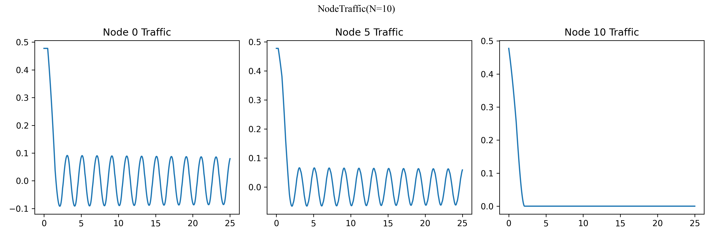


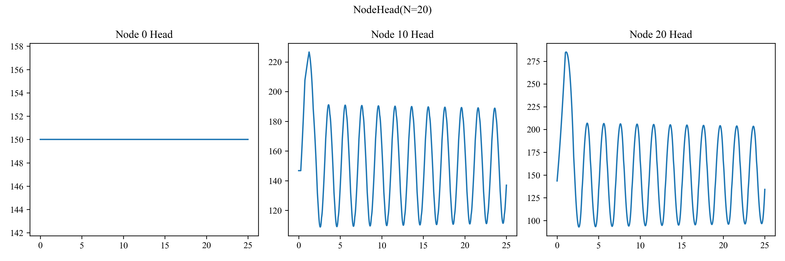

结算结果见Question2文件夹，可以看到计算结果没有显著差异，这完成了网格无关性验证。

## 第三问

这一问可以修改Question3.py脚本中不同的关闭时间t_c值进行计算，运行结果得到的图像已经保存到Question3文件夹。可以看到，关闭过程持续时间越短，则水流的振荡越大，这体现在其水头和流量都发生剧烈波动，而关闭过程持续时间越长则相应的水流变化越平缓。

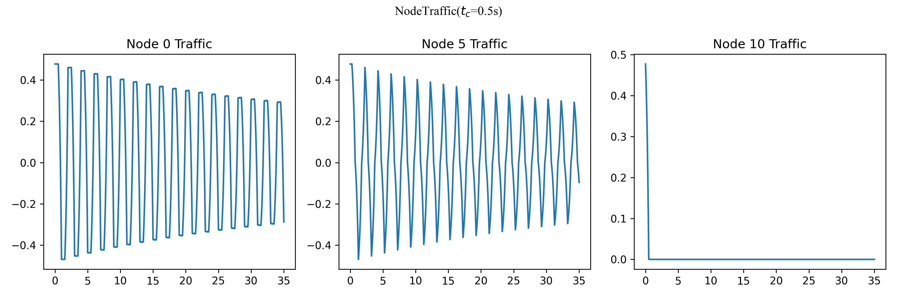

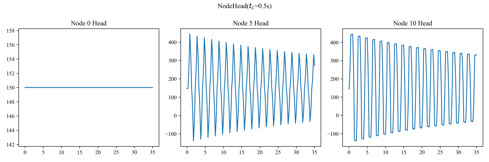

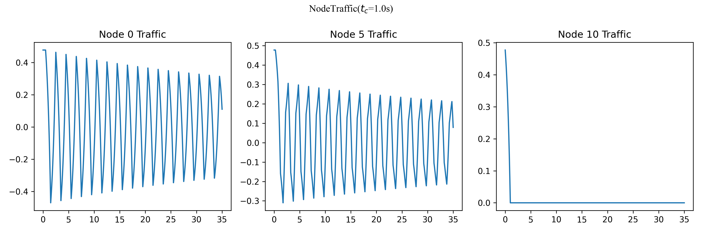

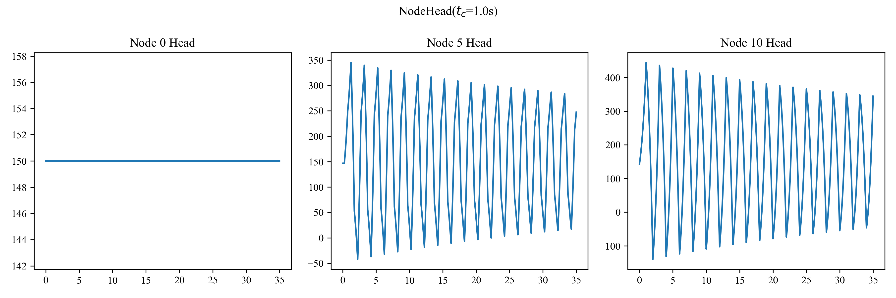

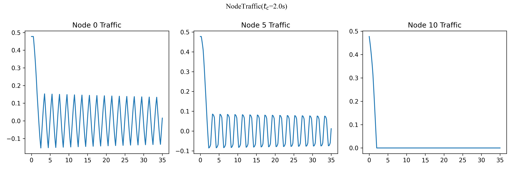

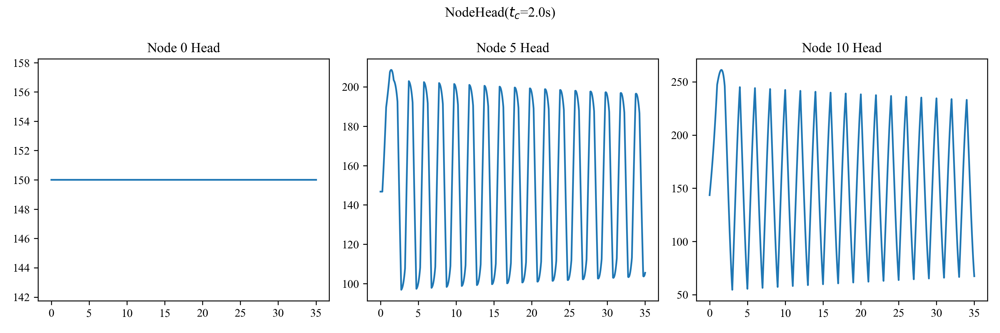

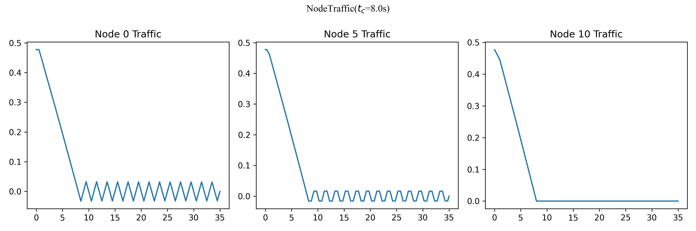

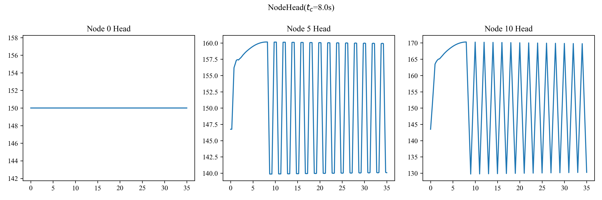

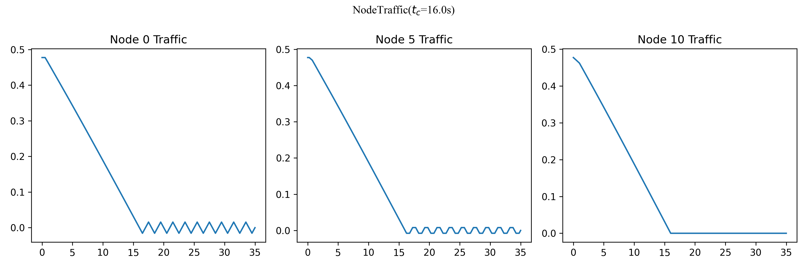

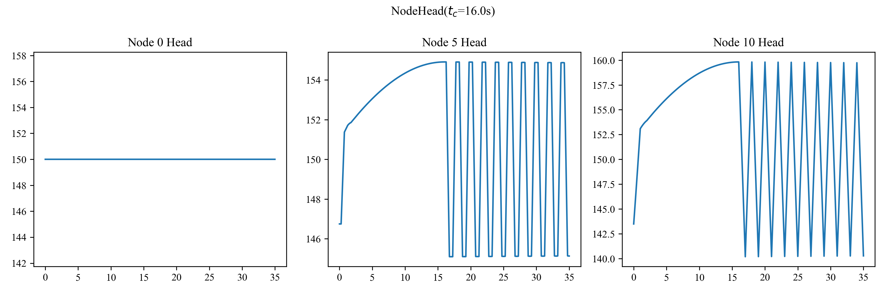

## 第四问

这一问可以修改Question4.py脚本中不同的开启时间t_s值进行计算，运行结果得到的图像已经保存到Question4文件夹。可以看到，开启过程持续时间越短，则水头在过程中的变化越大，而开启过程持续时间越长则相应的水头变化幅值越越小，当然，持续时间越长则流量、水头达到稳态的时间也越长。


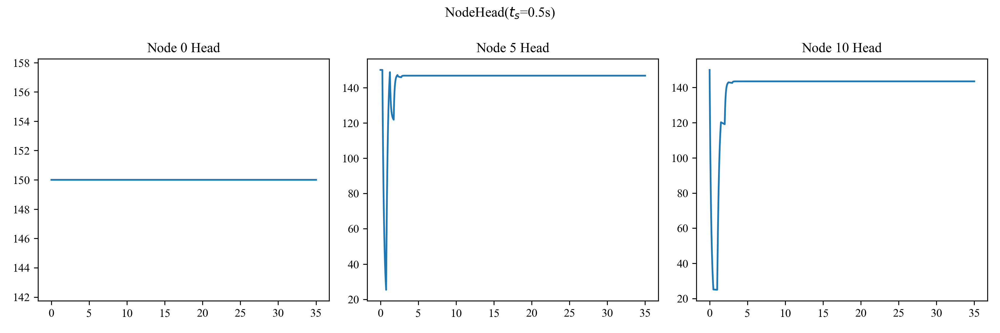

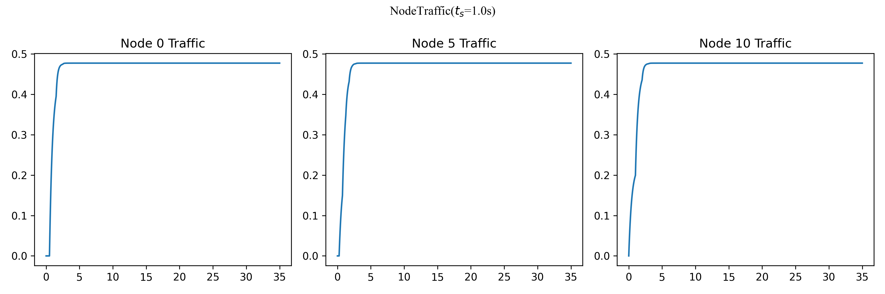

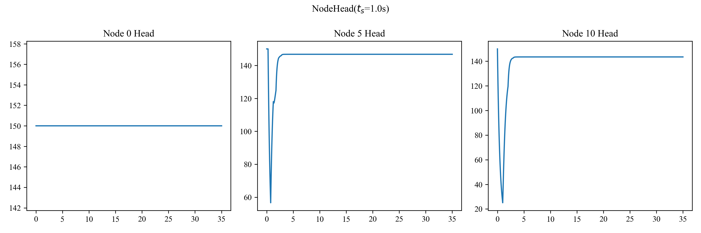

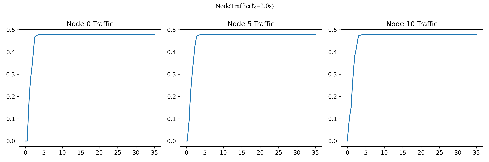

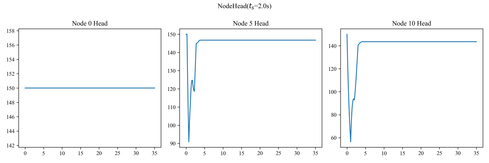

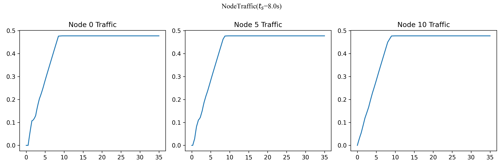

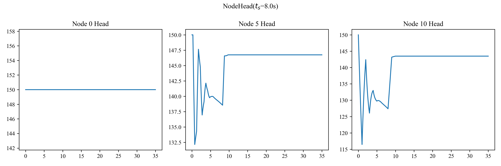

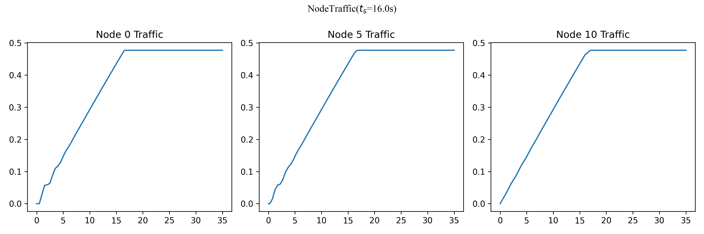

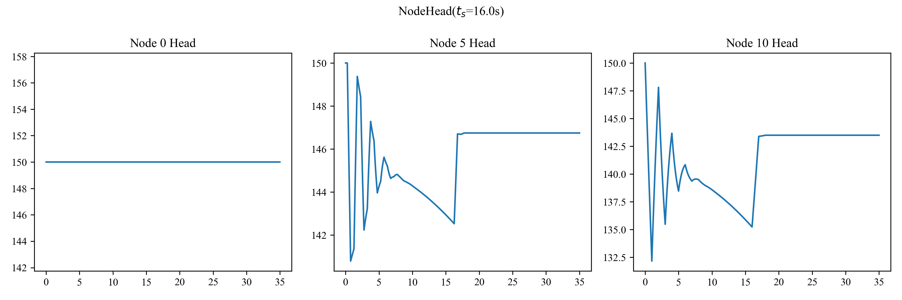

## 第五问

直接运行Question5.py得到结果，如图。

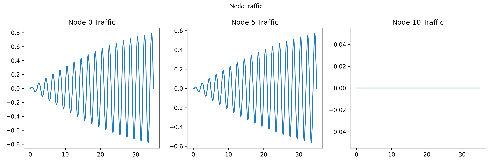

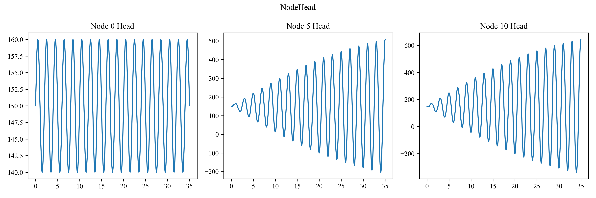

## 第六问

这一问中所取的周期函数为$\tau = sin (\pi t)$，运行脚本Question6.py得到结果，如图

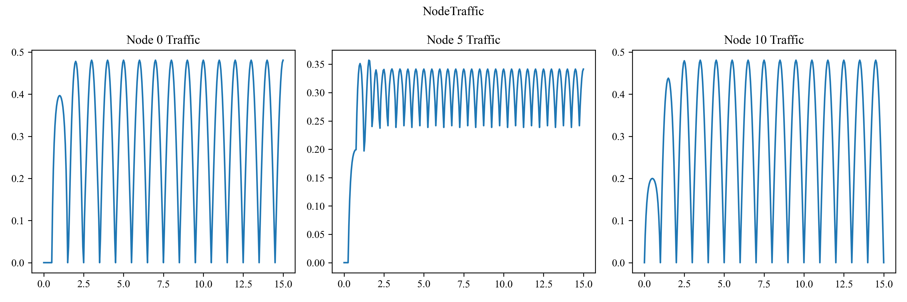

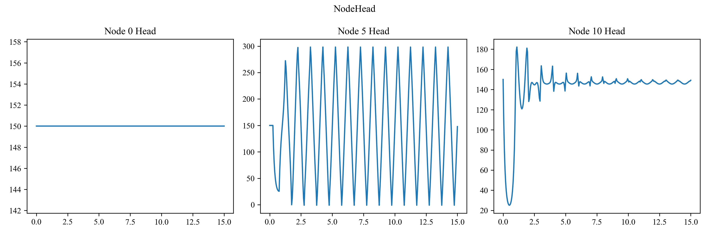

可以看到，在阀门为周期性运动的情况下，管道中各店的流量也呈现周期性波动，但值得注意的是阀门处的水头将趋于稳态。

## 第七问

这里采取的是线性关闭的过程$\tau = 1 -t/t_c,t_c = 2s$进行研究，运行脚本Question7.py，可以输入不同的f,a,L的值，观察输入图像。可以有以下结论。

* Darcy-Weisbach摩擦系数$f$越大，则水头、流量的振荡衰减越快，水头、流量能够更快的趋于稳定。
* 比值$L/a$决定了振荡的频率，该比值越小，则振荡的频率越快。
* 值$L$与水头、流量的振荡幅值有关，$L$越大相应的振荡幅值也将越大。

## 第八问
