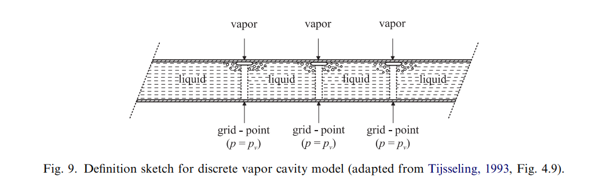

# Seperation of the Water Coloumns in Water Hammer Event

## Water Hammer Event

A water hammer is a type of water hammer that generates shock waves due to the inertia of the pressure water flow during sudden power outages or when the valve is closed too quickly, just like a hammer striking. The force generated by the back and forth flow of water shock waves can sometimes be significant, causing damage to valves and pumps.

## Column Seperation

Column separation refers to the breaking of liquid columns in fully filled pipelines. This may occur in a water-hammer event when the pressure in a pipeline drops to the vapor pressure at specific locations such as closed ends, high points or knees (changes in pipe slope). The liquid columns are separated by a vapor cavity that grows and diminishes according to the dynamics of the system. The collision of two liquid columns, or of one liquid column with a closed end, may cause a large and nearly instantaneous rise in pressure. This pressure rise travels through the entire pipeline and forms a severe load for hydraulic machinery, individual pipes and supporting structures. The situation is even worse: in one water-hammer event many repetitions of cavity formation and collapse may occur.

**So we need a theoratically numerical way to calculate the state paremeters as an analytical method!**

---

## Water Hammer Event Calculation without Considering Seperation

An common method is MOC(method of characteristics),which is literally the first assignment of the course and is Familiar to all of us. Don't bother to repeat.

**But there do exist problems:**

* Pressure drops significantly below the vapor pressure. According to thermodynamic theory, can't this happen! 

* So vapor cavity would be generated, and therefore diminish, causing significantly dynamic effects.

---

## A Simple Way To Calculate The Seperation Effect

According to the artificial context, a commmonly used way is called **The discrete vapor cavity model (DVCM)**, which can be demonstrated as the figure shown below:

Cavities are allowed to form at any of the computational sections (grid points) if the pressure is computed to be below the vapor pressure. Vapor cavities are thus confined to computational sections as sketched in Fig above and pure liquid with a constant pressure wave speed is assumed in between. The absolute pressure in a cavity is set equal to the vapor pressure:

$$
p = p_v
$$

and the upstream and downstream discharges $Q_{Pv}$ and ${Q_P}$ at a cavity are computed from the compatibility. The cavity volume $e$ follows then from

$$
\dot{e} = Q_P-Q_{Pv}
$$

A discrete form

$$
e^{t+dt} -e^{t} =  (\psi (Q_P^{t+dt}-Q_{Pv}^{t+dt}) + (1-\psi) (Q_P^{t}-Q_{Pv}^{t}))\cdot dt
$$

notitcing that $\psi$ is hyper-parameter dependent on experiment, probabally a task of our group is to adjust the $\psi$ to gain good results.

---

## Now the Task

Establish the model on python or MATLAB, verify the effectiveness of the DVCM and attempt to explain some physical features.

## Future the Work

Apparently, the DVCM is not an complete model, it is also our goal to establish other models, including high-dimentional models (not 1-dimentional trivial model), such as shadow-flow model, 2-phase flow model, etc. CFD simulation may be considered, too.